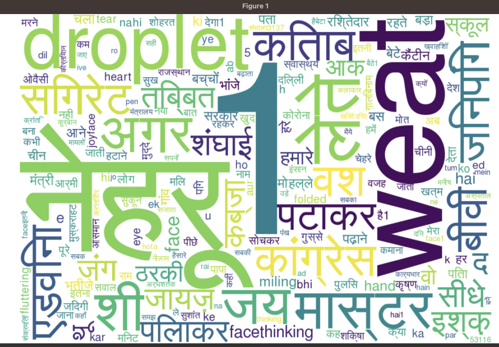
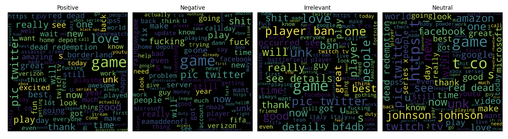

# Sentiment Analysis Research

This repository contains research on sentiment analysis, which is the automated process of determining and classifying opinions expressed in text. The research focuses on the use of machine learning algorithms to evaluate social media material in Hindi and English.

## Table of Contents

- [Introduction](#introduction)
- [Data Collection and Preprocessing](#data-collection-and-preprocessing)
- [Feature Engineering](#feature-engineering)
- [Machine Learning Models](#machine-learning-models)
- [Experiments and Evaluation](#experiments-and-evaluation)
- [Implications](#implications)
- [Keywords](#keywords)

## Introduction

In the age of social media, sentiment analysis, a subfield of NLP and machine learning, has become crucial for extracting valuable insights from user-generated content. It aims to computationally determine emotional tone and subjective information in text, with applications ranging from business intelligence to political analysis. This research focuses on sentiment analysis, emphasizing multilingual datasets encompassing English and Hindi. Social media platforms have transformed communication, offering vast repositories of opinions and emotions. This research explores sentiment analysis's challenges and applications in this dynamic landscape, particularly in multilingual contexts.

## Data Collection and Preprocessing

In this research project, data collection and preprocessing are fundamental steps in preparing datasets for sentiment analysis in both English and Hindi. Kaggle, a renowned platform for data science and machine learning, serves as our data source. We focus on datasets with associated sentiment labels (positive or negative). The key data collection steps involve exploring Kaggle's extensive dataset repository, selecting relevant datasets, and ensuring linguistic diversity by considering both English and Hindi data. These datasets provide ground truth sentiment labels for model training and evaluation.

Data preprocessing is essential to clean and prepare the text data for analysis. This involves several steps:

1. **Text Cleaning:** Raw text data is often noisy with elements like HTML tags, special characters, and URLs. Text cleaning techniques are applied to remove these artefacts and ensure the text's cleanliness.

2. **Tokenization:** Text is broken down into individual words or tokens, a fundamental step in converting text into analyzable units.

3. **Stopword Removal:** Common stopwords, which contribute minimal semantic value, are removed from the text to streamline the data and reduce dimensionality.

4. **Stemming and Lemmatization:** Variations of words, such as plurals or verb tenses, are normalized using stemming or lemmatization to treat similar words as the same feature.

Feature extraction techniques, such as TF-IDF vectorization and word embeddings like Word2Vec or GloVe, are employed to convert the text data into numerical vectors suitable for machine learning models. To address potential class imbalances in sentiment labels, we may use oversampling or undersampling techniques for dataset balancing. The datasets are split into training, validation, and testing subsets, allowing for model training, hyperparameter tuning, and performance evaluation. Lastly, sentiment labels are encoded into numerical values (e.g., 0 for negative and 1 for positive) to facilitate model training.

These data collection and preprocessing steps are crucial in preparing clean and structured datasets for the subsequent stages of sentiment analysis research.

## Feature Engineering

A significant part of this research is dedicated to feature engineering, a critical aspect of machine learning. The goal is to enable algorithms to better capture the nuances of sentiment in text data. The feature engineering process includes various steps:

1. **Text Normalization:** All text data is transformed to lowercase to ensure uniformity in processing.

2. **URL and Mention Removal:** URLs and mentions (e.g., "@username") are removed from the text as they often do not contribute to sentiment analysis.

3. **Whitespace Removal:** Extra whitespace, including multiple consecutive spaces, is replaced with a single space to improve text readability.

4. **Hashtag Handling:** Hashtags (e.g., "#topic") are simplified to a common character, '1', to retain their essence while removing the '#' symbol.

5. **Punctuation Removal:** Punctuation marks such as periods, colons, exclamation marks, question marks, hyphens, single and double quotation marks, and forward slashes are removed from the text.

6. **Stripping Quotes:** Leading and trailing single and double quotation marks are stripped from the text.

7. **Tokenization:** Tokenization breaks down text data into individual words or tokens. While English uses space-based tokenization, Hindi text, without spaces between words, requires specialized techniques.

8. **Stopword Removal:** Common and unnecessary words, known as stopwords, are removed from the text. Specific stopwords and their removal are not detailed.

9. **Removing Newlines:** Any newline characters ('\n') within the tokens are removed.

10. **Emoji Removal:** Emojis are removed from the text data.

The feature engineering process ensures that the text data is clean, uniform, and ready for analysis.

## Data Analysis and Visualizations

The sentiment analysis project began with the use of the TextBlob library, a rule-based approach to sentiment analysis. However, TextBlob's performance had limitations, especially in handling complexities and nuances in tweets.

To visualize word frequency distributions, the project used the wordcloud library in Python. This facilitated the creation of visually appealing representations of word frequency. Word clouds were generated for both Hindi and English datasets, offering insights into prominent words and themes in the data.

To address limitations and enhance accuracy, advanced machine learning algorithms tailored for natural language processing were integrated. This approach aimed to achieve higher accuracy in sentiment classification by capturing intricate patterns and nuances in tweets that rule-based methods may miss. The integration of machine learning algorithms also ensured the robust handling of diverse and dynamic Twitter data, allowing the system to generalize effectively to unseen tweets.

This comprehensive feature engineering and analysis process forms the foundation of the sentiment analysis research, enabling a deeper understanding of sentiment in multilingual datasets.

## Machine Learning Models

The core of the research lies in the investigation of two prominent machine learning models: Naive Bayes and Logistic Regression. These models are meticulously explained, emphasizing their mathematical foundations and inner workings. The Naive Bayes theorem, rooted in conditional probability, is demystified to provide a comprehensive understanding of its application in sentiment analysis.

## Experiments and Evaluation

The research design encompasses extensive experiments and evaluations, aiming to assess the performance of these algorithms across different languages and cultural contexts. Metrics like accuracy, sensitivity, specificity, and F1 score are employed to provide a holistic evaluation of the models' effectiveness.

## Implications

The implications of this research extend beyond sentiment analysis, influencing the fields of natural language processing and social media analytics. The findings contribute significantly to our understanding of how machine learning can be harnessed to decipher sentiment across diverse linguistic landscapes, fostering advancements in sentiment analysis research.

## Keywords

- Human emotion analysis
- Machine learning
- Natural language processing
- Social media analysis
